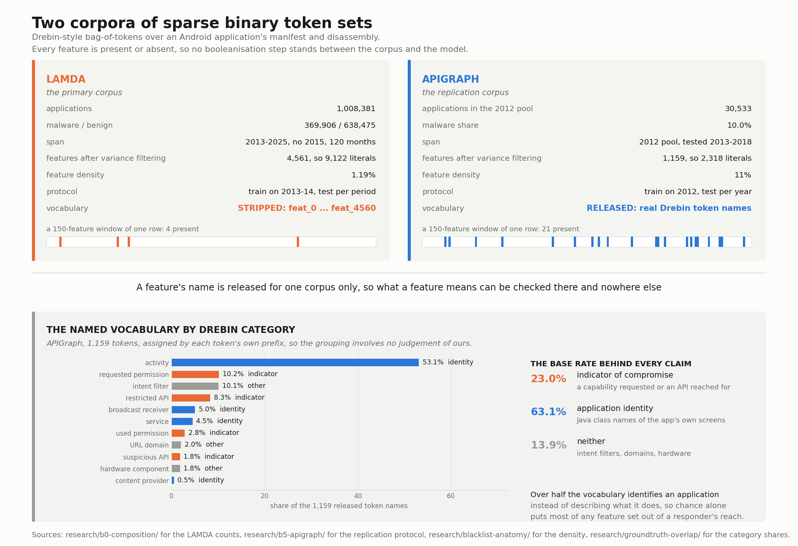
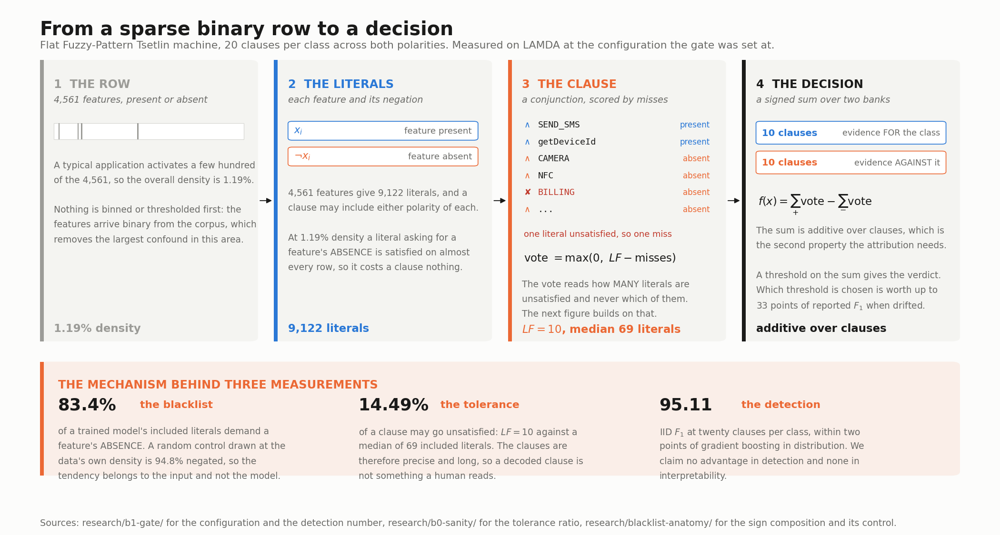
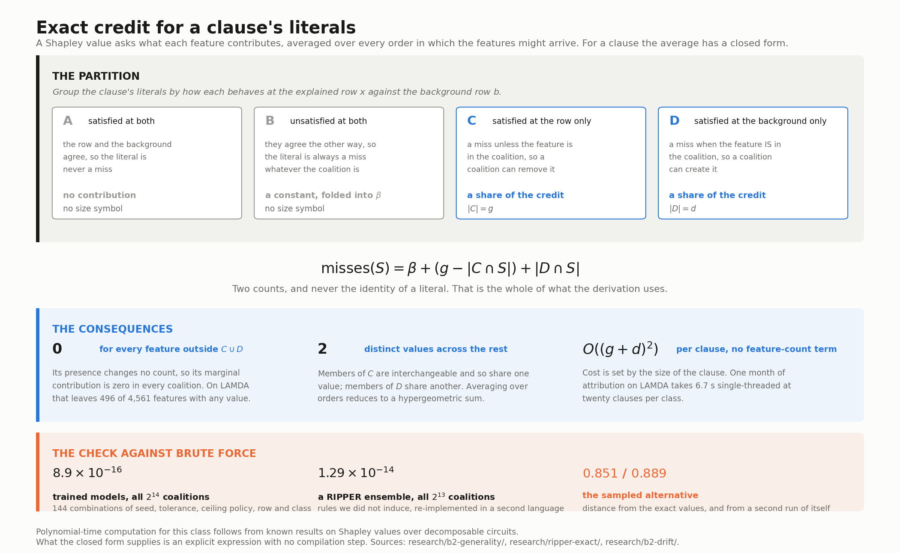
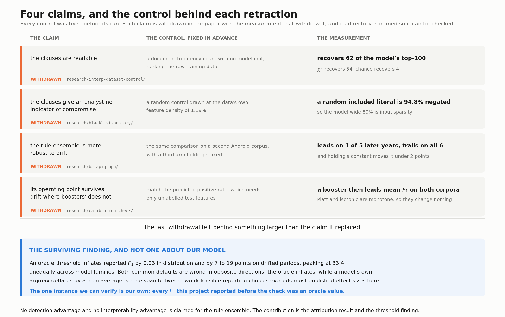

# TM-Cyber

Exact feature attribution for rule ensembles, and what it says about **explanation drift** in Android
malware detection. Flat Fuzzy-Pattern Tsetlin machines over static Drebin-style features, evaluated on
[LAMDA](https://arxiv.org/abs/2505.18551) and cross-checked on
[APIGraph](https://dl.acm.org/doi/10.1145/3372297.3417291) under temporal splits.

> **A paper reporting these results is in preparation.** This repository carries the code, the raw
> output and a write-up for every experiment, including the ones that retracted earlier claims. The
> manuscript is not public yet. Until it is, the `research/` directories are the citable record, and
> each states its own configuration, its pre-registered criterion and its result. Two follow-up
> studies are under way, on adversarial aspects and on on-edge deployment at low energy, and
> [Follow-up work](#follow-up-work) says what neither of them has measured yet.

## The result

A malware detector's explanation is reported to drift: the features it relies on turn over almost entirely from month to month, whilst its accuracy holds.
That measurement comes from a **sampled** attribution estimator whose own variance goes unreported. It need not be sampled.

A Tsetlin machine's clauses can be printed, which says what the model contains and not how much one
feature counted towards a single decision. The figure under test is a Shapley value, so testing it
takes a Shapley value, and Shapley values are the only unit in which a Tsetlin machine, a booster and
an induced ruleset are comparable at all.

For any additive ensemble of rules whose output depends only on **how many** of a rule's literals are
unsatisfied, not on which, exact Shapley values have a closed form costing `O((g+d)²)` per rule,
independent of the feature count. The class takes in Fuzzy-Pattern and classical Tsetlin machines,
*m*-of-*n* threshold ensembles and weighted rule ensembles. It provably excludes ordered rule lists and
raw disjunctive rulesets, and that boundary is measured, not assumed.

| | |
|---|---|
| agreement with brute-force enumeration | **8.9e−16** over 144 configurations |
| the same, on rules from RIPPER, a 1995 rule learner we did not write | **1.29e−14**, all 2¹³ coalitions |
| ordered rule lists, where additivity fails | **1.1e−1**, against 2e−13 for the additive arms |
| cost at 4,561 features, 100 background × 100 explained | **6.7 s** per month, single-threaded |

The computation is not an approximation. It is exact, and at this width it **costs less than the sampled
estimate it replaces**, with a cost per clause that does not grow with the feature count.

With an exact instrument, one published number separates into three:

| | Jaccard distance |
|---|---|
| reported in the literature | 0.958 |
| **the estimator's own noise floor** — same month, same model, explainer re-run | **0.926** |
| refitting a fresh model each month, as the released code does | 0.661 |
| **pure data drift** — one fixed model, the data moving | **0.294** |

So the reported figure is, in descending order of magnitude, an estimator's variance, an experimental
choice, and only then the phenomenon. At the budget used, the sampled estimator lands as far from the
exact values (0.851) as it lands from a second run of itself (0.889): **the error is variance, not bias**.
That replicates to three decimals on an ensemble built from RIPPER's rules. RIPPER is a rule learner from 1995 that reads labelled data and writes IF-THEN rules; it has no connection to this work, so the result is a property of sampled attribution at this budget and not of Tsetlin machines.

## The input, the model and the assignment of credit

Three questions come before any result below: what a feature is in this setting, what the model
computes from it, and how credit for a decision is divided among features.



The rows are sparse binary token sets. Two consequences run through everything else. At **1.19%**
density on the primary corpus, a literal asking for a feature to be *absent* is satisfied on almost
every row, which is why a trained model looks like a blacklist. And the primary corpus ships its
vocabulary stripped, as `feat_0 ... feat_4560`, so no claim about what a feature *means* can be made
there. The replication corpus releases real token names, and more than half of them are Java class
names of an application's own screens, which identify an app and transfer to nothing.



The model is a vote. Each clause is a conjunction over included literals, scored as
`max(0, LF - misses)`, and the class score is a signed sum over two banks of ten clauses. Two
properties of that vote carry the rest of this repository: the score reads **how many** literals are
unsatisfied and never which, and it is **additive** over clauses.



Those two properties are what make exact attribution available. A vote that counts failures
without reading their names cannot tell two features that fail in the same way apart, so credit has
to treat them alike. Group a clause's literals by how each behaves at the explained row against the
background row, and the vote turns on two counts.
Every feature outside those two groups has Shapley value exactly zero, which on the primary corpus
leaves 496 of 4,561 features with any value at all, and the cost is `O((g+d)^2)` per clause with no
feature-count term. Polynomial-time computation for this class follows from known results on Shapley
values over decomposable circuits; what the closed form supplies is an explicit expression needing
no compilation step.

## Claims and withdrawals



Four claims were measured and withdrawn, each by a control fixed before the run. They are listed here and not buried, because the controls are reusable and the retractions are the part of this work most
likely to save someone else a month.

- **No readability claim.** A document-frequency count with no model in it recovers **62 of the model's
  top-100** attributed features; χ² recovers 54; chance recovers 4. Most of what the clauses point at, a
  one-line frequency count also points at.
- **No "clauses give no indicator of compromise".** Four in five included literals do require a feature
  to be *absent*, but at this density a **random** included literal is **94.8%** negated — a negated
  literal is satisfied for free on almost every row. The model-wide figure is the sparsity of the input.
  The features the model actually relies on are 53% negated and present in 42% of malware against 24% of
  goodware — and on the corpus whose vocabulary is released, 85% of the attributed top-20 are
  permissions or suspicious API calls against a 23% base rate, so they are indicators in the operational
  sense too.
- **No drift-robustness advantage.** The LAMDA advantage of 4 to 12 F1 on four of five drifted years did
  not replicate on APIGraph, and a third arm holding the effective specificity `s = width/S` constant
  rules out that confound.
- **No threshold-transfer advantage.** Gradient boosting transfers its operating point badly under a
  validation-F1 threshold rule and well under predicted-positive-rate matching. The advantage belonged to
  the threshold rule, not to the model.

What the last withdrawal left behind is worth more than the claim it replaced, and it is a statement about
how this area evaluates and not about any model in it: **an oracle threshold inflates reported F1 by
0.03 in distribution and by 7 to 19 points on drifted periods, peaking above 33**, unequally across model
families. Two defensible-looking reporting choices therefore span more than most published effect sizes
here. The deployable recommendation is to match the predicted positive rate, which needs only unlabelled
test features and helps gradient boosting more than it helps a Tsetlin machine.

## Findings that stand

| | |
|---|---|
| [`research/b2-generality/`](research/b2-generality/) | count-symmetry plus additivity is the whole requirement; the class and its boundary |
| [`research/ripper-exact/`](research/ripper-exact/) | the same, on an externally induced ruleset, with the variance-not-bias result replicating off-family |
| [`research/b0-noise-floor/`](research/b0-noise-floor/) | the reported explanation drift sits at its own estimator's noise floor |
| [`research/b2-drift/`](research/b2-drift/) | the five pre-registered arms over 88 months; the decomposition above |
| [`research/interp-dataset-control/`](research/interp-dataset-control/) | the control that retracts readability |
| [`research/groundtruth-overlap/`](research/groundtruth-overlap/) | the attributed features are indicators: 85% indicator-class in the top 20 against a 23% base rate, and the one place the model beats the corpus |
| [`research/blacklist-anatomy/`](research/blacklist-anatomy/) | the sparsity control that retracts the second claim |
| [`research/interp-residual/`](research/interp-residual/) | the 38 features a frequency count misses are where the model fails to generalise |
| [`research/interp-residual-retrain/`](research/interp-residual-retrain/) | the pruning survives retraining but splits by period, so it is not a recommendation |
| [`research/residual-density-control/`](research/residual-density-control/) | the gain is about *which* features, not how dense they are: the matched control raises it from +5.28 to +6.07 |
| [`research/threshold-bias/`](research/threshold-bias/) | the threshold rule is an unstated free parameter worth up to 33 F1 |
| [`research/b3-label-drift/`](research/b3-label-drift/) | the label boundary moves: 40% to 80% of each year's malware would be relabelled at a stricter threshold |
| [`research/lf-attribution/`](research/lf-attribution/) | tolerance is representational and saturates by `LF ≈ 5`; the one question a classical Tsetlin machine cannot be asked |
| [`research/b4-footprint-labels/`](research/b4-footprint-labels/) | 44.5 KB to infer, 356.3 KB to keep learning; 250 fresh labels beat 150,090 stale ones by 59 F1 |

[`research/INDEX.md`](research/INDEX.md) carries every experiment with its verdict, including the ones that were calibration and not findings.

## Out of scope

- **Not a claim that online learning solves drift.** Online updating makes *applying* a label nearly
  free; it does not produce labels, and antivirus consensus is slow. LAMDA's own 2024–25 malware counts,
  794 and 23 samples against roughly 45,000 benign per year, are that latency made visible. Measured per
  label spent, continual updating is indistinguishable from retraining from scratch, and retaining the
  historical data is worse than discarding it at every budget tested.
- **Not a claim of interpretability by construction.** Interpretability is measured here and, on this
  data, not found. See the retractions above.
- **Not a robustness result.** No adversary is assumed anywhere. Attribution has been used to construct
  backdoors in malware classifiers, and an attack or defence resting on a sampled attribution inherits
  the variance measured here, but that application is not pursued here. It is a follow-up direction,
  as the next section records.
- **Not flow-feature intrusion detection**, which is saturated near 99% and dominated by dataset
  artefacts, and not a graph or message-passing result.

## Follow-up work

Two studies are under way. Neither has a result in this repository, and the second has no measurement
of any kind yet.

- **Adversarial aspects.** The question runs both ways and the answer is not the comfortable one by
  default. A clause that tolerates a few unsatisfied literals may hold up when an attacker flips a few
  bits, or partial matching may hand that attacker a cheaper path than a strict conjunction would,
  because the attacker chooses which bits to flip. Attribution is part of the same study: backdoors in
  malware classifiers have been built from explanations, and anything built on a sampled attribution
  inherits the variance measured here. Online updating is a poisoning surface of its own, and the
  label-efficiency result above is what would be traded away to close it.
- **On-edge deployment and energy.** Inference is a bitwise AND and a popcount over 64-bit words, and
  the model measured here is 44.5 KB to infer and 356.3 KB to keep learning. That is the arithmetic an
  energy argument would rest on, and the energy itself is not measured anywhere in this repository: no
  joules, no board, no duty cycle. The follow-up measures it on hardware rather than deducing it from
  the instruction mix. Ultra-low-energy intrusion detection with Tsetlin machines is an active line at
  CAIR under [SecureIoTM](https://www.uia.no/english/research/research-projects/engineering-and-science/secureIotm/index.html).
  That project has already put an interpretable Tsetlin intrusion detector on a Raspberry Pi
  ([arXiv:2605.16707](https://arxiv.org/abs/2605.16707)). The direction is not ours alone, and that
  work is the comparison a follow-up has to make.

## Starting points

This work consumes a Tsetlin stack it did not write, and three pieces of prior work carry most of
the machinery.

- **The Tsetlin machine** — Granmo, *A Game Theoretic Bandit Driven Approach to Optimal Pattern
  Recognition with Propositional Logic*, [arXiv:1804.01508](https://arxiv.org/abs/1804.01508). The
  learning scheme: clauses as conjunctions over literals, teams of automata updated by reinforcement,
  a class decided by a vote. The attribution result here is a statement about that vote.
- **The Fuzzy-Pattern Tsetlin machine** — Hnilov,
  [arXiv:2508.08350](https://arxiv.org/abs/2508.08350). The variant used throughout, and the source
  of the clause vote `max(0, LF - misses)` with its tolerance `LF`. That the vote reads *how many*
  literals are unsatisfied and never which of them is the property the closed form rests on, so the
  attribution result follows the design of this model rather than our own.
- **The reference implementations** — [Tsetlin.jl](https://github.com/BooBSD/Tsetlin.jl) and
  [FuzzyPatternTM](https://github.com/BooBSD/FuzzyPatternTM), both Hnilov, both MIT. The packed
  clause-evaluation layout the `.tmx` format mirrors comes from the first, which is why loading a
  matrix is a reinterpret and not a conversion. The published IMDb settings in the second are where
  this project's starting hyperparameters came from.

The wider line is set out in Granmo et al., *The Tsetlin Machine Goes Deep*,
[arXiv:2507.14874](https://arxiv.org/abs/2507.14874). Graph and message-passing work is out of scope
here, as [Out of scope](#out-of-scope) records.

Attribution obligations are in [NOTICE.md](NOTICE.md).

## Layout

```
julia/shapley.jl          the closed form; O((g+d)^2) per clause, no feature-count dependence
julia/bootstrap.jl        clones the Tsetlin stack into vendor/ at a pinned commit
julia/tmx.jl              reads the packed feature matrix as model inputs
python/tmcyber/           dataset handling, splits, baselines; writes the packed matrix
docs/matrix-format.md     the .tmx format spec — header plus raw packed words
docs/clause-attribution.md  the attribution pre-registration: arms, protocol, falsification conditions
research/<name>/          experiments: run script, raw output, README with the question and the answer
docs/figures/            the figures above, each with the script that drew it
test/shapley_closed_form.jl  brute-force enumeration against the closed form, 144 configurations
tools/                    bootstrap and arm fan-out for a rented CPU box
```

The Python/Julia boundary is the binarised feature matrix. Feature extraction, dataset handling,
baselines and statistics are Python; Tsetlin training, clause inspection and attribution are Julia.

## Setup

```
julia --project=. julia/bootstrap.jl
julia --project=. -e 'using Pkg; Pkg.instantiate()'

python -m venv .venv
pip install -r requirements.txt
```

Then check the boundary, which every result depends on being bit-exact:

```
python test/boundary.py write /tmp/fx
julia --project=. test/boundary.jl /tmp/fx
python test/boundary.py verify /tmp/fx
```

`bootstrap.jl` clones [tm-lab](https://github.com/Lukasz-G/tm-lab) at a pinned commit instead of vendoring it, so experiments reproduce from a fresh checkout without carrying another project's source.
`Manifest.toml` is not committed; the root `Project.toml` records the package paths.

Datasets are not committed. LAMDA is `IQSeC-Lab/LAMDA` on HuggingFace (DOI 10.57967/hf/5563).

Heavier sweeps run on a rented CPU box: `tools/vast_setup.sh` installs a pinned Julia and the pinned
Tsetlin stack, `tools/fanout.sh` runs experiment arms in parallel and appends each result to one small
log as it finishes. Cores go to arms, not to making one run faster. Training can thread across
classes or across clauses, but at the clause budgets used here neither pays, and at the smallest the
clause axis is slower than running serially. Scoring does thread across examples, bit-identically, which
is what the attribution work needs.

## Method notes

- **Every F1 needs its threshold rule.** The span between an oracle threshold and an achievable one
  reaches 33 F1 on drifted periods and differs between model families, so a figure quoted without its
  rule is not yet a measurement. Figures here state the rule.
- **Never a mean across 2018–2025.** LAMDA's later years carry too little labelled malware for a mean to
  mean anything, and such a mean reports antivirus label lag as a result. Everything is per year, and the
  usable window is 2013–2022.
- **LAMDA is balanced 50:50 by design**, which its authors argue for as a benchmark property. It does not
  reflect deployment, so precision and alert volume here do not transfer to operation; APIGraph, at 10%
  malware, is the closer corpus.
- **Clause counts are per class across both polarities**, matching the reference implementation, so
  "20 clauses" is unambiguous.
- **`L` is a growth gate, not a cap.** It gates whether a clause may grow in a given round and does not
  bound clause size; clauses here run several times over it. No result reports clause sizes as bounded by
  `L`.
- **The ceiling policy and the parallelisation mode change what a number means.** Both are recorded with
  every measurement, alongside the pinned implementation commit: the parallel mode changes the random
  draws, so the same algorithm at the same seed under a different mode is a different model.

## Licence

MIT — see [LICENSE](LICENSE). Uses the tm-lab Tsetlin stack, which derives from Tsetlin.jl and
FuzzyPatternTM; attribution obligations are in [NOTICE.md](NOTICE.md).
